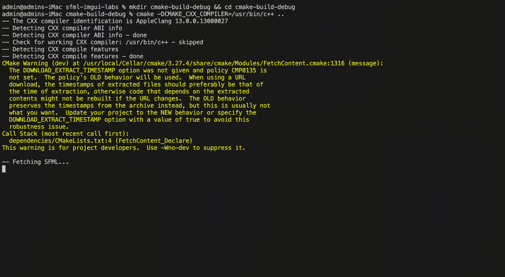

# sfml-imgui-labs

SFML / Dear ImGui / ImGui-SFML sandbox project.


### Prerequisites

- `ninja`
- `cmake`
- c++ compiler (`clang`, `gcc`, etc.)

### 1. Installing and Setting Up Ninja

On macOS, you can use the Homebrew package manager:

```shell
brew install ninja
```

If you already have Ninja installed, ensure it's available in your `PATH`. You can test this by running:

```shell
ninja --version
```

If this returns a version number, it means Ninja is correctly installed and available in the `PATH`.

---

### 2. C++ Compiler

Ensure you have a C++ compiler installed. On macOS, you typically use Clang, which comes with Xcode. If you haven't already, install Xcode and the Xcode Command Line Tools:

<details>
<summary>Expand</summary>

```shell
xcode-select --install
```

</details>

---

### 3. _**Optional**_: Fetching dependencies

This project comes with the dependencies pre-installed.
If necessary, the dependencies can be re-installed using the below commands:

<details>
<summary>Expand</summary>

```shell
rm -rf dependencies
mkdir dependencies && cd dependencies
```

```shell
git submodule add https://github.com/SFML/SFML.git dependencies/sfml
git submodule add https://github.com/eliasdaler/imgui-sfml.git dependencies/imgui-sfml
```

</details>

---

### 4. Building

```shell
rm -rf cmake-build-debug
mkdir cmake-build-debug && cd cmake-build-debug
```

To specify the compiler for CMake, you can set the `CMAKE_CXX_COMPILER` variable:

```shell
cmake -DCMAKE_CXX_COMPILER=/usr/bin/c++ ..
```

Replace `/usr/bin/c++` with the path to your preferred C++ compiler if it's different.


It will take some time to fetch SFML. Afterwards, the build will finish with similar output as shown below:



```sh
cmake --build .
./src/square_grid_2
```


